# EARLY BUDDY (얼리버디) iOS

### 서비스 소개

약속시간을 위한 나만의 대중교통 배차 알리미 얼리버디 🐧💞

------

### Work-Flow

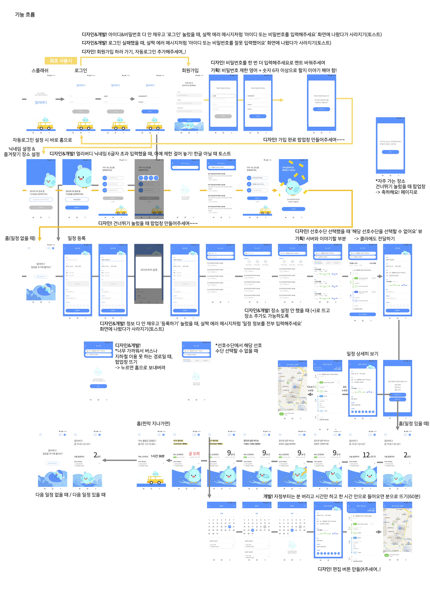

------

### 개발환경 

✔️ Swift 5

✔️ Xcode 11.3

### 사용한 라이브러리

✔️ Alamofire

✔️ Hero

✔️ Snapkit

------

### 실행화면

🐧 홈화면 🐧

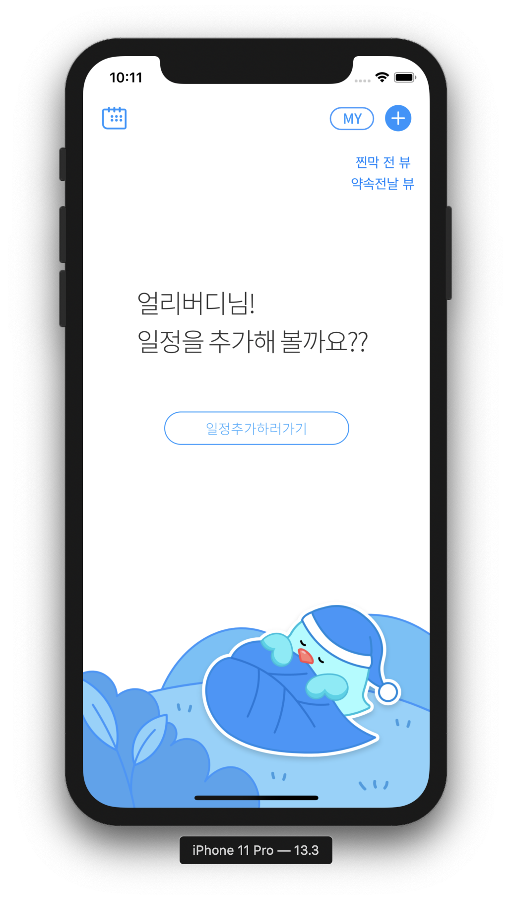</img>
</img>
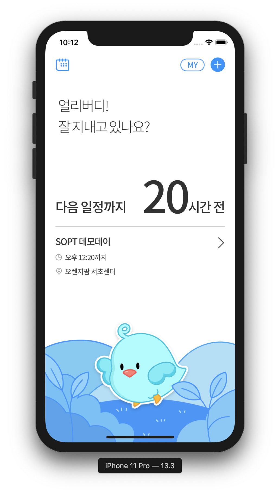</img>
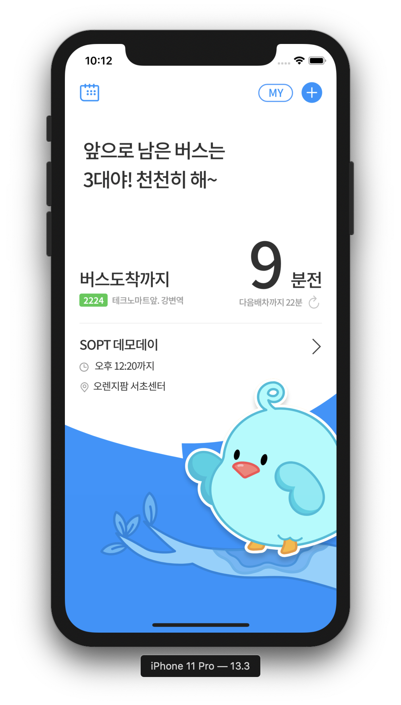</img>
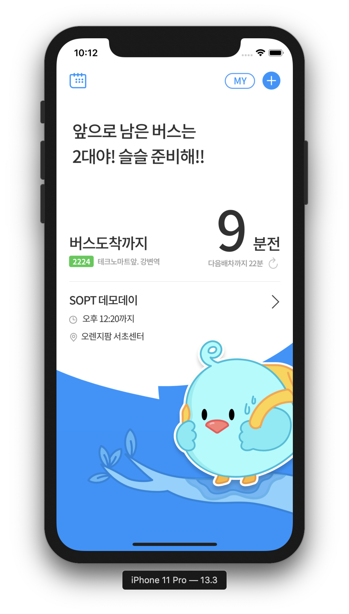</img>
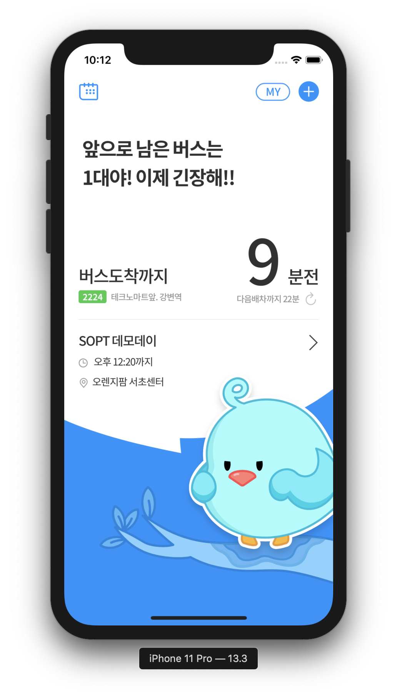</img>
</img>
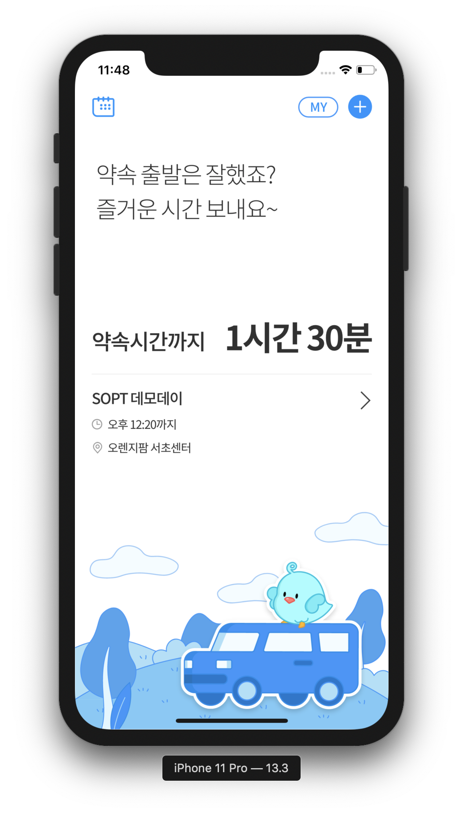</img>
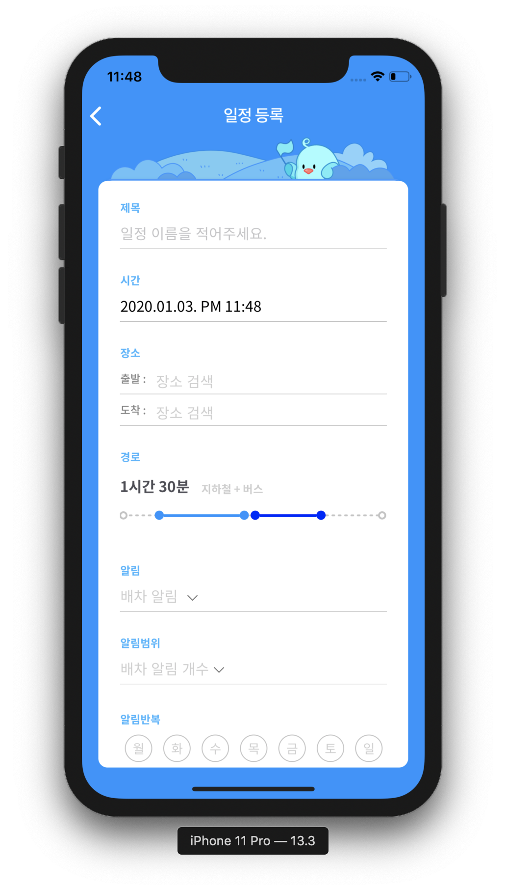</img>
</img>
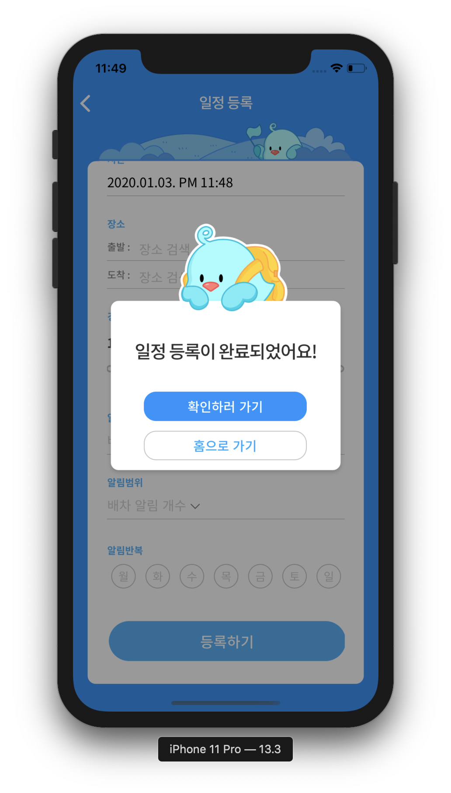</img>
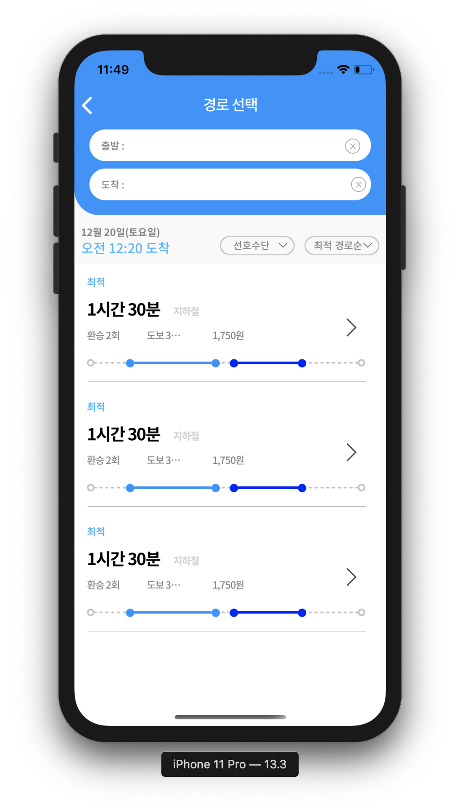</img>
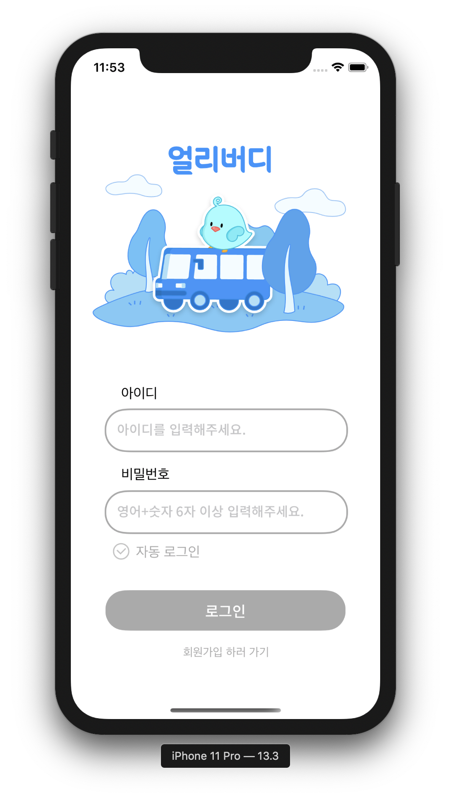</img>
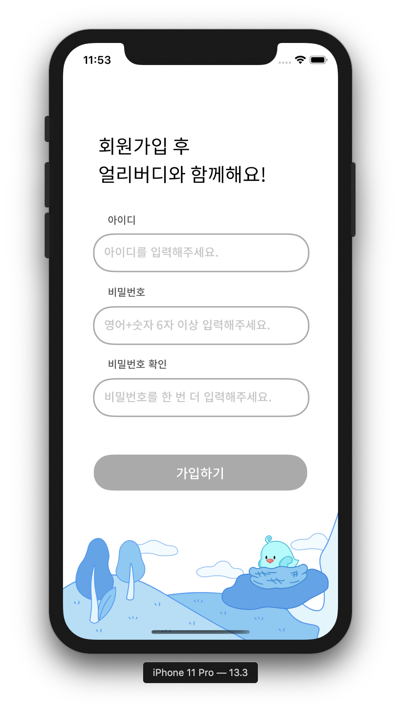</img>
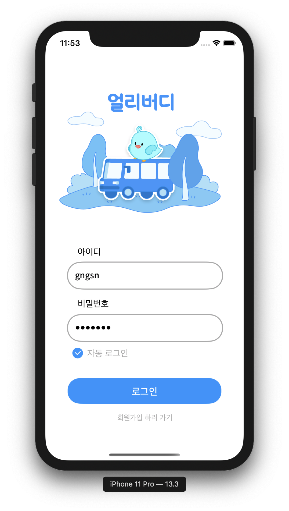</img>
</img>
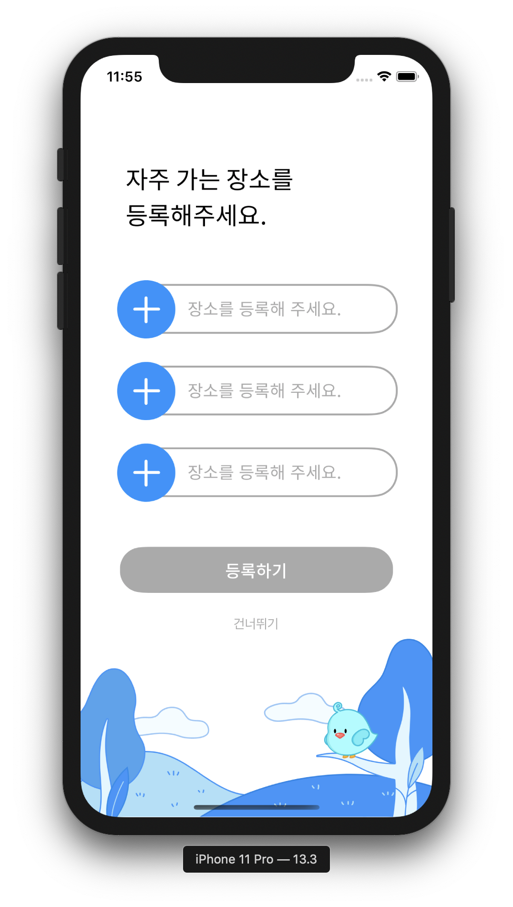</img>
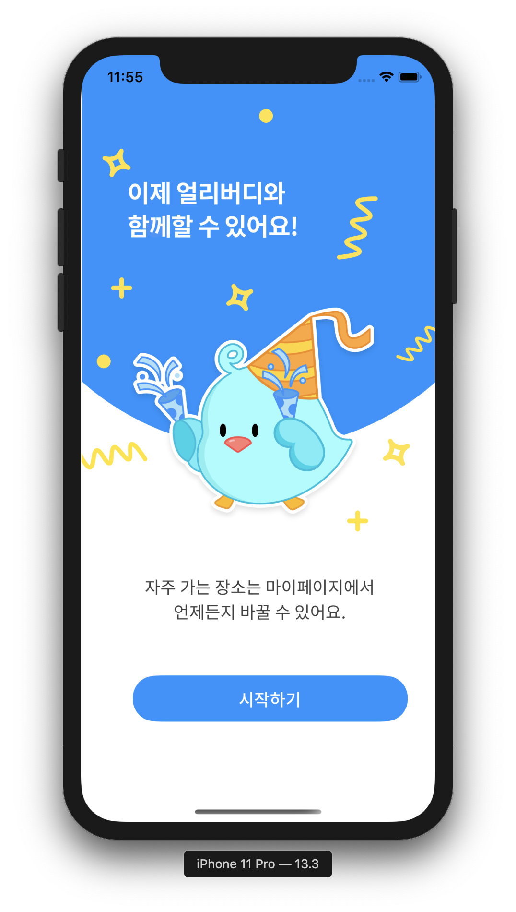</img>


🐧 일정등록 🐧

------

### 기능소개

|       기능        | 우선순위 |          개발여부          |                    담당                    |
| :---------------: | :------: | :------------------------: | :----------------------------------------: |
|     푸시알람      |  1순위   | 개발자 계정 없어 진행 불가 |                     -                      |
|        홈         |  1순위   |  뷰 완성<br />통신 진행중  |                    현지                    |
|     일정 등록     |  1순위   |  뷰 완성<br />통신 진행중  |                    현지                    |
|     주소 검색     |  1순위   |  뷰 완성<br />통신 진행중  |                    현지                    |
|   경로 보여주기   |  1순위   |  뷰 완성<br />통신 진행중  |                    현지                    |
|    정거장 위치    |  1순위   |         뷰 진행중          |                    현지                    |
|   일정 상세보기   |  1순위   |  뷰 완성<br />통신 진행중  |                    현지                    |
|     최초사용      |  2순위   |  뷰 완성<br />통신 진행중  |                    경선                    |
| 로그인 / 회원가입 |  2순위   |  뷰 완성<br />통신 진행중  |                    경선                    |
|      캘린더       |  2순위   |         뷰 진행중          | 뷰 기능 - 현지<br />라이브러리 수정 - 효진 |
|    마이페이지     |  3순위   |         뷰 진행중          |                    현지                    |

------

### 문제점과 해결방법

🆘 경로 뷰를 동적으로 움직이는 것에 어려움을 겪음

✔️ 테이블 뷰 안에 컬렉션 뷰 넣어서 셀의 width를 동적으로 그림

✔️ 테이블 뷰에서 expandable 효과를 적용해 경로를 그림

```swift
// 뷰에 나타나는 경로 계산
func timeRate(dummySet: [Route]) -> [Double] {
        // view width 318
        var ratio = [Double]()
        dummySet.forEach {
            if $0.type != .none {
                ratio.append(Double(318/90) * Double($0.min!))
            } else {
                ratio.append(10.0)
            }
        }
        print("*****\(ratio)")
        return ratio
}

// 테이블 뷰 프로토콜 정의 (더미데이터)
extension SelectPathViewController: UITableViewDelegate, UITableViewDataSource {
    
    func tableView(_ tableView: UITableView, numberOfRowsInSection section: Int) -> Int {
        return 3
    }
    
    func tableView(_ tableView: UITableView, cellForRowAt indexPath: IndexPath) -> UITableViewCell {
        let cell = tableView.dequeueReusableCell(withIdentifier: "PathCell", for: indexPath) as! PathCell
        let path = paths[indexPath.row]
        
        cell.totalTimeLabel.text = path.totalTimeLabel
        cell.totalTransport.text = path.totalTransport
        cell.transferCount.text = path.transferCount
        cell.totalWalkTime.text = path.totalWalkTime
        cell.totalCost.text = path.totalCost
        cell.testSet = testSet
        cell.ratio = timeRate(dummySet: testSet)
        
        return cell
    }
    
    func tableView(_ tableView: UITableView, heightForRowAt indexPath: IndexPath) -> CGFloat {
        return 150
    }
}
```

🆘 네비게이션 바를 커스텀하고, 다른 스토리보드로 네비게이션 연결하는 것에 어려움을 겪음

✔️ 다른 스토리보드로 연결할 때 pushViewController를 사용해서 연결하고, 코드로 네비게이션 바를 커스텀

```swift
override func viewWillAppear(_ animated: Bool) {
  ...
        addImageButton.addTarget(self, action: #selector(goToMine), for: .touchUpInside)
  ...
}

// 다른 스토리보드로 화면 전환
@objc func goToMine() {
                guard let nextVC = UIStoryboard(name: "Schedule", bundle: nil).instantiateViewController(withIdentifier: "MainScheduleViewController") as? MainScheduleViewController else { return }
        nextVC.modalPresentationStyle = .fullScreen
        self.navigationController?.pushViewController(nextVC, animated: true)
}

// 네비게이션 바 커스텀 함수
func customNavigationBar() {
        self.view.layer.backgroundColor = UIColor.white.cgColor
        self.navigationController?.setNavigationBarHidden(false, animated: true)
        self.title = "장소 선택"
        self.navigationController?.navigationBar.titleTextAttributes = [.foregroundColor: UIColor.white, .font: UIFont(name: "NotoSansKR-Medium", size: 18)!, .kern: CGFloat(-0.9)]
        self.navigationController?.navigationBar.barTintColor = UIColor.mainblue
        self.navigationController?.navigationBar.shadowImage = UIImage()
        self.navigationController?.navigationBar.isTranslucent = false
        self.navigationController?.navigationBar.backIndicatorImage = UIImage(named: "ic_back")
        self.navigationController?.navigationBar.backIndicatorTransitionMaskImage = UIImage(named: "ic_back")
        self.navigationController?.navigationBar.topItem?.title = ""
        self.navigationController?.navigationBar.tintColor = UIColor.white
}
```

🆘 dismiss되는 팝업 뷰에서 기존 뷰로 데이터를 전달하는 것에 어려움을 겪음

✔️ 프로토콜을 정의해 Delegate Pattern 적용

```swift
// dismiss되는 뷰 컨트롤러
protocol SendDataDelegate {
    func sendData(data: String)
}

class PreferPopUpViewController: UIViewController {
  var delegate: SendDataDelegate?
  
  @IBAction func confirmAction(_ sender: UIButton) {
        if !allCheckImg.isHidden {
            if let data = allLabel.titleLabel?.text {
                delegate?.sendData(data: data)
                dismiss(animated: true, completion: nil)
            }
        } else if !busCheckImg.isHidden {
            if let data = busLabel.titleLabel?.text {
                delegate?.sendData(data: data)
                dismiss(animated: true, completion: nil)
            }
        } else {
            if let data = subwayLabel.titleLabel?.text {
                delegate?.sendData(data: data)
                dismiss(animated: true, completion: nil)
            }
        }
    } 
}

// 값을 전달받는 뷰 컨트롤러

class SelectPathViewController: UIViewController, SendDataDelegate {
  // delegate 함수 정의
  func sendData(data: String) {
        preferLabel.text = data
  }
```

🆘 팝업 창에서 버튼을 클릭하면 홈으로 네비게이션 pop 되어야하는 효과가 있었는데, 팝업 뷰에는 navigation controller가 연결되어있지 않아 pop이 적용되지 않았음

✔️  onFinished(), onComplete() 함수를 적용해 해결

```swift
// 팝업 뷰 컨트롤러
class PopUpViewController: UIViewController {
  var onFinished: (() -> Void)?
  var onComplete: (() -> Void)?
  
  override func viewDidLoad() {
      super.viewDidLoad()
      self.homeButton.addTarget(self, action: #selector(goToHome), for: .touchUpInside)
      self.checkButton.addTarget(self, action: #selector(goToDetail), for: .touchUpInside)
  }
  
  @objc func goToHome() {
        self.confirm = false
        self.dismiss(animated: true)
        onFinished?()
  }
  
  @objc func goToDetail() {
        self.confirm = true
        print("goToDetail \(confirm)")
        self.dismiss(animated: true)
        onComplete?()
  }
}

// 팝업 뷰를 띄우는 뷰 컨트롤러
    @IBAction func showConfirmAction(_ sender: UIButton) {
      let storyboard = UIStoryboard(name: "Schedule", bundle: nil)
      let myAlert = storyboard.instantiateViewController(withIdentifier: "PopUpViewController") as! PopUpViewController
      myAlert.modalPresentationStyle = UIModalPresentationStyle.overCurrentContext
      myAlert.modalTransitionStyle = UIModalTransitionStyle.crossDissolve
      guard let nextVC = UIStoryboard(name: "Schedule", bundle: nil).instantiateViewController(identifier: "DetailScheduleViewController") as? DetailScheduleViewController else { return }
      nextVC.modalPresentationStyle = .fullScreen
        
      myAlert.onFinished = { [weak self] in
          self?.navigationController?.popViewController(animated: true)
      }
        
      myAlert.onComplete = { [weak self] in
          self?.navigationController?.pushViewController(nextVC, animated: true)
      }
        
      self.present(myAlert, animated: true, completion: nil)
    }
```

🆘 통신 시 접근시간 초과의 이슈가 있었음

✔️  대중적인 이슈지만, 아직 해결법을 찾지 못함
------
### 얼리버디 iOS 개발자 
👩🏻‍💻 (리드) [김현지](https://github.com/khyunjiee)</br>
 - SOPT 25기 iOS 파트 YB 김현지입니다 :)</br>
 - 좋은 팀원들 덕분에 행복한 앱잼 중입니다 !!</br>
 👩🏻‍💻 (서포트) [박경선](https://github.com/gngsn)</br>
 👩🏻‍💻 [황효진](https://github.com/hwang-hyojin)</br>
 - SOPT 25기 iOS 파트 YB 황효진입니다!</br>
 - 귀여운 이비 보면서 힘내는 중➿🐦


